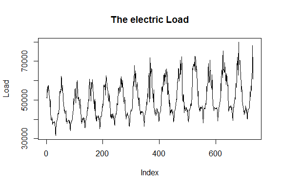
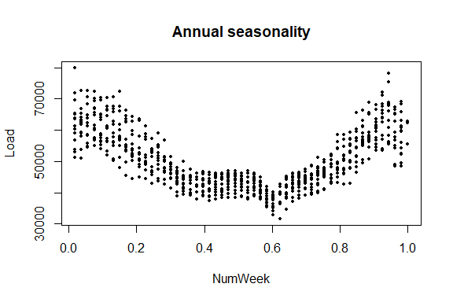
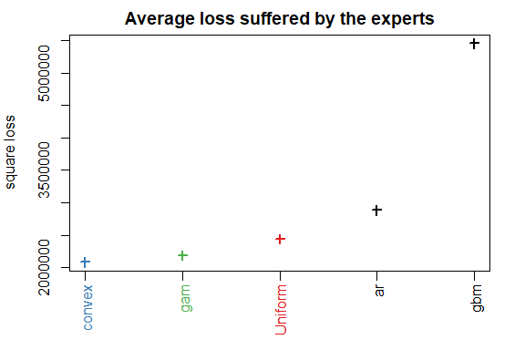
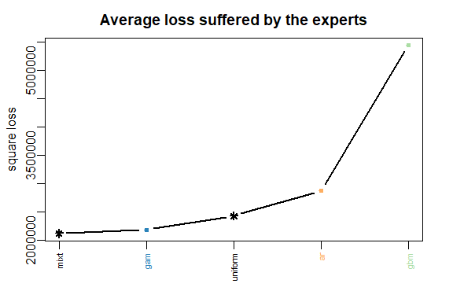

README
================
Pierre Gaillard, Yannig Goude


<!-- README.md is automatically generated by README.Rmd: do not edit README.md by hand -->

`opera` is a R package that provides several algorithms to perform
robust online prediction of time series with the help of expert advice.
In this vignette, we provide an example of how to use the package.

## Setting: when is the package `opera` useful?

Consider a sequence of real bounded observations \(y_1,\dots,y_n\) to be
predicted step by step. Suppose that you have at your disposal a finite
set of methods \(k =1,\dots,K\) (henceforth referred to as experts) that
provide you before each time step \(t=1,\dots,n\) predictions
\(x_{k,t}\) of the next observation \(y_t\). You can form your
prediction \(\widehat y_t\) by using only the knowledge of the past
observations \(y_1,\dots,y_{t-1}\) and past and current expert forecasts
\(x_{k,1},\dots,x_{k,t}\) for \(k=1,\dots,K\). The package
<a href=#>opera</a> implements several algorithms of the online learning
literature that form predictions \(\widehat y_t\) by combining the
expert forecasts according to their past performance. That is, \[
  \widehat y_t = \sum_{k=1}^K p_{k,t} x_{k,t} \,.
\] These algorithms come with finite time worst-case guarantees. The
monograph of [Cesa-Bianchi and Lugisi
(2006)](http://www.ii.uni.wroc.pl/~lukstafi/pmwiki/uploads/AGT/Prediction_Learning_and_Games.pdf)
gives a complete introduction to the setting of prediction of arbitrary
sequences with the help of expert advice.

### What are the most important functions?

The package `opera` provides three important functions: `mixture` to
build the algorithm object, `predict` to make a prediction by using the
algorithm, and `oracle` to evaluate the performance of the experts and
compare the performance of the combining algorithm.

## Installation

opera is now available on CRAN, so you can install it with:

``` r
install.packages("opera")
```

You can also install the development version of opera with the package
devtools:

``` r
install.packages("devtools")
devtools::install_github("dralliag/opera")
```

You may be asked to install additional necessary packages. You can
install the package vignette by setting the option: build\_vignettes =
TRUE.

## Example: predict the weekly electricity consumption.

Here, we provide a concrete example on how to use the package. To do so,
we consider an electricity forecasting data set that includes weekly
observations of the French electric load together with several
covariates: the temperature, calendar information, and industrial
production indexes. The data set is provided by the French [National
Institute of Statistics and Economic Studies
(Insee)](http://www.insee.fr).

### The data set

First, we load the data and we cut it into two subsets: a training set
used to build the experts (base forecasting methods) and a testing set
(here the last two years) used to evaluate the performance and to run
the combining algorithms.

``` r
data(electric_load)
attach(electric_load)
idx_data_test <- 620:nrow(electric_load)
data_train <- electric_load[-idx_data_test, ] 
data_test <- electric_load[idx_data_test, ]  
```

The data is displayed in the following
figures.

``` r
plot(Load, type = "l", main = "The electric Load")
```

<p align="center">



</p>

``` r
plot(Temp, Load, pch = 16, cex = 0.5, main = "Temperature vs Load")
```

<p align="center">


</p>

``` r
plot(NumWeek, Load, pch = 16, cex = 0.5, main = "Annual seasonality")
```

<p align="center">



</p>

### First: build the expert forecasts

Here, we build three base forecasting methods to be combined later.

  - A generalized additive model using the `mgcv` package:

<!-- end list -->

``` r
library(mgcv)
gam.fit <- gam(Load ~ s(IPI) + s(Temp) + s(Time, k=3) + 
                 s(Load1) + as.factor(NumWeek), data = data_train)
gam.forecast <- predict(gam.fit, newdata = data_test)
```

  - A medium term generalized additive model followed by an
    autoregressive short-term correction.

<!-- end list -->

``` r
# medium term model
medium.fit <- gam(Load ~ s(Time,k=3) + s(NumWeek) + s(Temp) + s(IPI), data = data_train)
electric_load$Medium <- c(predict(medium.fit), predict(medium.fit, newdata = data_test))
electric_load$Residuals <- electric_load$Load - electric_load$Medium

# autoregressive correction
ar.forecast <- numeric(length(idx_data_test))
for (i in seq(idx_data_test)) {
  ar.fit <- ar(electric_load$Residuals[1:(idx_data_test[i] - 1)])
  ar.forecast[i] <- as.numeric(predict(ar.fit)$pred) + electric_load$Medium[idx_data_test[i]]
}
```

  - A gradient boosting model using `caret` package

<!-- end list -->

``` r
library(caret)
gbm.fit <- train(Load ~ IPI + IPI_CVS + Temp + Temp1 + Time + Load1 + NumWeek, 
                 data = data_train, method = "gbm")
gbm.forecast <- predict(gbm.fit, newdata = data_test)
```

Once the expert forecasts have been created (note that they can also be
formed online), we build the matrix of expert and the time series to be
predicted online

``` r
Y <- data_test$Load
X <- cbind(gam.forecast, ar.forecast, gbm.forecast)
matplot(cbind(Y, X), type = "l", col = 1:6, ylab = "Weekly load", 
        xlab = "Week", main = "Expert forecasts and observations")
```

<p align="center">


</p>

### How good are the experts? Look at the oracles

To evaluate the performance of the experts and see if the aggregation
rules may perform well, you can look at the oracles (rules that are used
only for analysis and cannot be design
online).

``` r
oracle.convex <- oracle(Y = Y, experts = X, loss.type = "square", model = "convex")
plot(oracle.convex)
```

<p align="center">



</p>

``` r
print(oracle.convex)
#> Call:
#> oracle.default(Y = Y, experts = X, model = "convex", loss.type = "square")
#> 
#> Coefficients:
#>    gam    ar    gbm
#>  0.719 0.201 0.0799
#> 
#>                       rmse   mape
#> Best expert oracle:   1480 0.0202
#> Uniform combination:  1560 0.0198
#> Best convex oracle:   1440 0.0193
```

The parameter `loss.type` defines the evaluation criterion. It can be
either the square loss, the percentage loss, the absolute loss, or the
pinball loss to perform quantile regression.

The parameter `model` defines the oracle to be calculated. Here, we
computed the best fixed convex combination of expert (i.e., with
non-negative weights that sum to
one).

### Aggregate the experts online using one of the possible aggregation procedures

The first step consists in initializing the algorithm by defining the
type of algorithm (Ridge regression, exponentially weighted average
forecaster,…), the possible parameters, and the evaluation criterion. If
no parameter is defined by the user, all parameters will be calibrated
online by the algorithm. Bellow, we define the ML-Poly algorithm,
evaluated by the square loss.

``` r
MLpol0 <- mixture(model = "MLpol", loss.type = "square")
```

Then, you can perform online predictions by using the `predict` method.
At each time, step the aggregation rule forms a new prediction and
update the procedure.

``` r
MLpol <- MLpol0
for (i in 1:length(Y)) {
  MLpol <- predict(MLpol, newexperts = X[i, ], newY = Y[i])
}
```

The results can be displayed with method `summary` and `plot`.

``` r
summary(MLpol)
#> Aggregation rule: MLpol 
#> Loss function:  square loss 
#> Gradient trick:  TRUE 
#> Coefficients: 
#>    gam    ar gbm
#>  0.577 0.423   0
#> 
#> Number of experts:  3
#> Number of observations:  112
#> Dimension of the data:  1 
#> 
#>         rmse   mape
#> MLpol   1460 0.0192
#> Uniform 1560 0.0198
```

``` r
plot(MLpol, pause = TRUE, col = brewer.pal(3,name = "Set1"))
```

<p align="center">



</p>

The same results can be obtained more directly:

  - by giving the whole time series to `predict` specifying `online =
    TRUE` to perform online prediction.

<!-- end list -->

``` r
MLpol <- predict(MLpol0, newexpert = X, newY = Y, online = TRUE)
```

  - or directly to the function mixture, when building the aggregation
    rule

<!-- end list -->

``` r
MLpol <- mixture(Y = Y, experts = X, model = "MLpol", loss.type = "square")
```

# Meta

  - Please [report any issues or
    bugs](https://github.com/dralliag/opera).
  - License: LGPL
